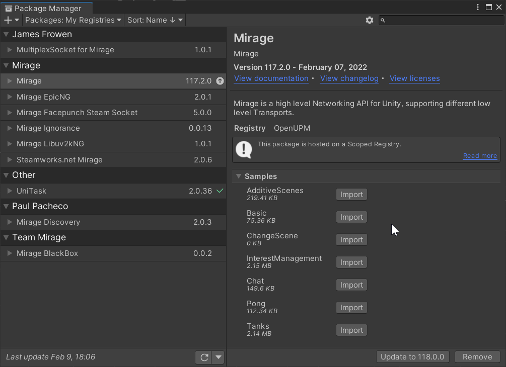

# Samples Overview

Mirage includes several small examples to help you learn how to use various features and how to set things up so they work together.
-   [Additive Scenes](AdditiveScenes/index.md)  
    The Additive Scenes example demonstrates a server additively loading a sub-scene into a main scene at startup, and having a server-only trigger that generates a message to any client whose player enters the trigger zone to also load the sub-scene, and subsequently unload it when they leave the trigger zone. Only players inside the trigger zone can see the objects in the sub-scene. Network Proximity Checker components are key to making this scenario work.
-   [Basic](Basic/index.md)  
    Basic is what it sounds like...the most rudimentary baseline of a networked game. Features SyncVars updating random UI data for each player.
    [Chat](Chat/index.md)  
    A simple text chat for multiple networked clients.
-   [ChangeScene](ChangeScene/index.md)  
    Provides examples for Normal and Additive network scene changing.
-   [Pong](Pong/index.md)  
    A simple example for "How to build a multiplayer game with Mirage" is Pong. It illustrates the usage of `NetworkManager`, `NetworkManagerHUD`, NetworkBehaviour, NetworkIdentity, `NetworkTransform`, `NetworkStartPosition`and various Attributes.
-   [Tanks](Tanks/index.md)  
    This is a simple scene with animated tanks, networked rigidbody projectiles, and NavMesh movement

## Import samples

Sample can be imported using the Unity Package manager. They can be found inside the `Samples` Dropdown.

